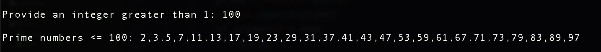

# eratosthenes
python implementation of greek mathematician's prime number algo

Here is the algorithm from the wiki cite below:

To find all the prime numbers less than or equal to a given integer n by Eratosthenes’ method:

1.  Create a list of consecutive integers from 2 through n: (2, 3, 4, …, n).
2.  Initially, let p equal 2, the first prime number.
3.  Starting from p, enumerate its multiples by counting to n in increments of p, and mark them in the list (these will be 2p, 3p, 4p, … ; the p itself should not be marked).
4.  Find the first number greater than p in the list that is not marked. If there was no such number, stop. Otherwise, let p now equal this new number (which is the next prime), and repeat from step 3.

As background, you can read about the algorithm here at the wiki: https://en.wikipedia.org/wiki/Sieve_of_Eratosthenes

Output for 100:

